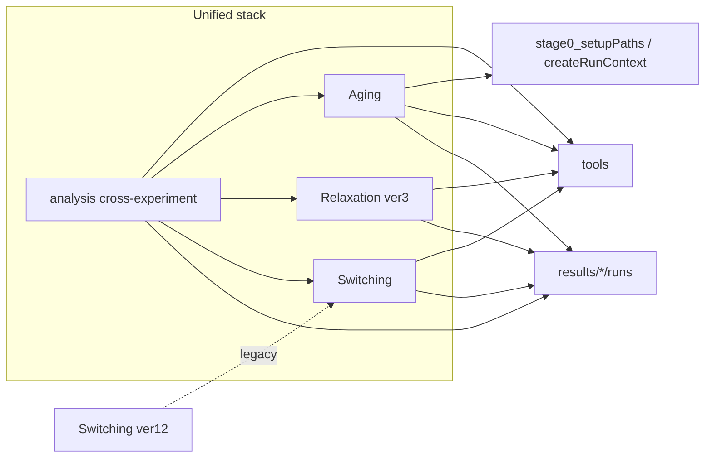

# Repository structural and functional audit

**Date:** 2026-03-24  
**Scope:** Read-only audit against authoritative docs (`docs/AGENT_RULES.md`, `docs/results_system.md`, `docs/repository_structure.md`, `docs/repo_state.json`, plus `docs/system_registry.json` and `docs/run_system.md` where cited by those sources).  
**Method:** Filesystem listing, pattern search over `*.m`, and spot-reads of representative entry points and helpers. No code was modified for this report.

---

## Executive summary

The repository is a **large, transitional MATLAB monorepo**: a **unified stack** (Aging, Relaxation v3, Switching, cross-`analysis/`) is **largely aligned** with a **run-scoped results model** under `results/<experiment>/runs/run_<timestamp>_<label>/`, with **`createRunContext`** and **`save_run_*` / `export_observables`** used widely in newer analysis paths. **Compliance is partial overall**: legacy and diagnostic code paths still use **direct `writetable` / `saveas`**, **flat historical `results/` subtrees** remain documented as acceptable legacy, **`Switching ver12/`** and **`General ver2/`** represent overlapping or deprecated patterns, and **documentation** shows **internal inconsistencies** (notably `results/README.md` vs `docs/output_artifacts.md`).

---

## 1. Repository structure

### 1.1 Actual top-level layout (conceptual)

Top-level directories observed on disk include:

| Zone | Examples on disk |
|------|------------------|
| **Unified stack / primary science** | `Aging/`, `Relaxation ver3/`, `Switching/`, `analysis/` |
| **Legacy / parallel experiment trees** | `Aging old/`, `Switching ver12/` |
| **Independent pipelines** (per `docs/system_registry.json`) | `AC HC MagLab ver8/`, `ARPES ver1/`, `FieldSweep ver3/`, `MH ver1/`, `MT ver2/`, `PS ver4/`, `Resistivity MagLab ver1/`, `Resistivity ver6/`, `Susceptibility ver1/`, `zfAMR ver11/`, `HC ver1/`, `Fitting ver1/`, `Tools ver1/` |
| **Shared infrastructure** | `tools/`, `docs/`, `results/`, `runs/`, `tests/`, `GUIs/`, `claims/`, `surveys/`, `reports/`, `scripts/`, `github_repo/` |
| **Local / tooling / non-standard** | `.vscode/`, `.github/`, `.appdata/`, `.codex_*`, `tmp*`, `snapshot_scientific_v3/`, etc. |

**Scale:** On the order of **~690+** `*.m` files under the repo (exact count drifts with commits).

### 1.2 Documented vs actual — mismatches

| Topic | Documented expectation | Actual / notes |
|-------|------------------------|----------------|
| **Target `modules/` tree** | `docs/repository_structure.md` describes a **target** `modules/<Experiment>/...` layout; agents must **not** create `modules/` unless asked | **No `modules/` directory** at repo root; experiments remain **top-level versioned folders** (`Aging/`, `Relaxation ver3/`, …). This matches the doc’s **transitional** story. |
| **“Active experiment modules” narrative** | `repository_structure.md` lists **three** primary experiment roots: `Aging/`, `Relaxation ver3/`, `Switching/` | **`docs/system_registry.json`** lists a broader **`active_modules`** set (includes `analysis`, instrument pipelines, `GUIs`, `tools`, `results`, etc.). Per **`docs/AGENT_RULES.md`**, the **registry is authoritative for module classification** — so the short list in `repository_structure.md` is a **subset narrative**, not the full registry. |
| **`docs/repo_state.json` vs filesystem** | Declares modules such as `ARPES` at `ARPES ver1/`, `Relaxation` at `Relaxation ver3/`, `Switching` at `Switching/` | Paths **match** existing folders; **entry_points / analysis_scripts** fields are **illustrative samples**, not an exhaustive inventory (many more scripts exist than listed). |
| **`results/README.md` artifact layout** | Lists subfolders including `csv/`, `archives/`, `artifacts/` | **`docs/output_artifacts.md`** and **`docs/results_system.md`** require **`figures/`, `tables/`, `reports/`, `review/`** and forbid ad-hoc names like `plots/`. **Conflict:** tracked `results/README.md` is **not aligned** with the authoritative artifact spec (precedence: `AGENT_RULES` → `results_system` → … → `output_artifacts`). |

### 1.3 Simple tree (depth-1 visualization)

```text
<repo>/
  Aging/              Aging old/
  Relaxation ver3/    Switching/           Switching ver12/
  analysis/           tools/               runs/          tests/
  results/            docs/                GUIs/          claims/    surveys/
  ARPES ver1/         FieldSweep ver3/     ... (other * verX instrument trees)
  github_repo/        scripts/             reports/       snapshot_scientific_v3/
  (+ local/tooling dirs: .vscode, tmp*, .codex_*, ...)
```

---

## 2. Entry points

### 2.1 `run_*` and `run*.m` style scripts

Pattern search located **~34** files matching `run_*.m` and **~36** matching `run*.m` (broader, includes e.g. `runRobustnessCheck.m`, `runPhaseC_leaveOneOut.m`, and legacy `RUN_URGENT_VALIDATION.m`).

**Representative groups:**

| Group | Role |
|-------|------|
| **`runs/run_aging.m`** | Documented-style launcher: path setup, `localPaths`, delegates to **`Main_Aging(cfg)`**. Matches `repository_structure.md` (“launch wrappers belong in `runs/`”). |
| **Repo-root `run_*_wrapper.m` (~16)** | Thin batch wrappers: `addpath` + call into **`analysis/`** functions (e.g. `run_amplitude_response_wrapper` → `switching_a1_amplitude_response_test`). **Convenient but not** entirely consistent with “launch wrappers belong in `runs/`” — many live at **repo root**. |
| **`Relaxation ver3/diagnostics/run_relaxation_*.m`** | Callable diagnostics (`function out = ...`) using **`createRunContext('relaxation', ...)`** and **`save_run_*`** in audited files. |
| **`ARPES ver1/run_arpes_*.m`** | Experiment-specific runners (listed in `docs/repo_state.json`). |
| **`analysis/run_unified_barrier_mechanism.m`** | Cross-experiment orchestration; uses a **local `createRun`** (see §4) rather than **`createRunContext`**. |
| **`scripts/run_adversarial_observable_search.m`** | Script-style entry under `scripts/` (not `runs/`). |
| **`tools/figure_repair/run_validation_suite.m`** | Tooling / validation harness. |

**Other major non-`run_` entry points:**

- **`Aging/Main_Aging.m`** — primary Aging pipeline entry (`docs/repo_state.json`).
- **`Relaxation ver3/main_relaxation.m`** — Relaxation entry (`docs/repo_state.json`).
- **`Switching ver12/main/Switching_main.m`** — legacy Switching pipeline (`repository_structure.md` “legacy”).
- Various **`*_main.m`** in instrument packages (`PS_main.m`, `HC_main.m`, etc.).

### 2.2 Alignment with run-based architecture

- **PASS (concept):** Canonical runs live under `results/<experiment>/runs/run_<timestamp>_<label>/` per `results_system.md` / `run_system.md`.
- **PARTIAL (practice):** Entry points are **split** across `runs/`, **repo root**, `analysis/`, `Relaxation ver3/diagnostics/`, `scripts/`, and legacy trees — consistent with **gradual alignment** policy in **`docs/AGENT_RULES.md`**, but **not** a single uniform “all launchers in `runs/`” layout.

---

## 3. Data flow and results system

### 3.1 Intended flow (from docs)

1. **Raw data** — configured via `cfg.dataDir`, `localPaths`, or module-specific importers (not fully traced in this audit).
2. **Processing / pipelines** — e.g. Aging `stage0_setupPaths` → `createRunContext`; instrument packages use their own mains.
3. **Observables** — exported via **`tools/export_observables.m`** / wide tables; **`observables.csv`** at **run root** as index (`results_system.md`, `AGENT_RULES` exception for `save_run_table`).
4. **Outputs** — **`figures/`, `tables/`, `reports/`, `review/`** + run metadata files (`run_manifest.json`, `config_snapshot.m`, `log.txt`, `run_notes.txt`).

### 3.2 Evidence of compliance in code

- **`Aging/pipeline/stage0_setupPaths.m`** calls **`createRunContext('aging', cfg)`** and documents run-scoped debug routing via **`getResultsDir`** — matches **`docs/run_system.md`**.
- **Many** `analysis/*.m` and `Switching/analysis/*.m` / `Aging/analysis/*.m` files call **`createRunContext`** and **`save_run_figure` / `save_run_table` / `save_run_report`**.
- **`Switching/analysis/switching_effective_observables.m`** writes **`observables.csv`** with **`writetable`** at **run root** (aligned with policy that root **`observables.csv`** may bypass `save_run_table`).

### 3.3 Inconsistencies / drift

| Issue | Detail |
|-------|--------|
| **Legacy flat `results/` paths** | Still referenced in comments and some logic (e.g. `results/switching/alignment_audit/...`) — **`results_system.md`** marks these as **historical**; policy says **no new** files there. |
| **Parallel run factory** | **`analysis/run_unified_barrier_mechanism.m`** defines **`createRun`** and writes via **`writetable` + custom paths** (`run.tablesDir`, etc.) — likely run-scoped, but **duplicates** the centralized **`createRunContext`** pattern. |
| **Direct I/O without `save_run_*`** | Numerous **`writetable` / `saveas`** usages in **`Aging/diagnostics/`**, **`Relaxation ver3/diagnostics/`** (e.g. survey / validation scripts), **`Fitting ver1/`**, **`General ver2/`** — **violates** the **strict helper rule** in **`AGENT_RULES.md`** for *new* agent-style analysis, even if some paths are **legacy**. |
| **`finalize_relaxation_aging_run.m`** | Post-processing helper with a **hard-coded default Windows path** to a specific run — **fragile** and **not** self-contained run creation; acceptable as a one-off tool but **not** a model for reproducible entry. |
| **`docs/repo_state.json` `run_system.expected_files`** | Includes **`observable_matrix.csv`** alongside **`run_manifest.json`** and **`observables.csv`** — **`results_system.md`** does **not** list `observable_matrix.csv` as a **required run-root** file (it may be **analysis-specific** under `tables/`). Treat **`repo_state.json`** as **project metadata** that may be **stricter or overlapping**, not identical to `results_system.md`. |

---

## 4. Core functions and logic

### 4.1 Central hubs

| Component | Role |
|-----------|------|
| **`Aging/utils/createRunContext.m`** | **Canonical run creation**; builds `results/<experiment>/runs/...`, manifest, log pointers; sets **root appdata** `runContext`. |
| **`Aging/utils/getResultsDir.m`** | Resolves output paths under active run (used from pipeline and diagnostics). |
| **`tools/save_run_figure.m`**, **`save_run_table.m`**, **`save_run_report.m`** | Artifact routing into **`figures/` / `tables/` / `reports/`**. |
| **`tools/export_observables.m`**, **`load_observables.m`** | Cross-run observable index I/O. |
| **`tools/init_run_output_dir.m`** | Related run directory initialization (referenced in codebase search). |
| **`Aging/pipeline/stage0_setupPaths.m`** | Aging’s **documented** run initialization hook per **`run_system.md`**. |

### 4.2 Duplicated / parallel patterns

- **`createRunContext`** vs **`run_unified_barrier_mechanism`’s `createRun`** — **duplicate run lifecycle** implementations.
- **Observable export:** mix of **`export_observables`**, **`writetable(..., 'observables.csv')`**, and wide tables named like `observables_*.csv` under **`tables/`** (e.g. relaxation stability audit) — **policy allows** root **`observables.csv`** as index; **multiple conventions** increase cognitive load.
- **Figure export:** **`save_run_figure`** vs raw **`saveas`** / **`General ver2/figureSaving/*`** — **`AGENT_RULES.md`** forbids **new** use of **General ver2** visualization utilities.

### 4.3 “Dead code” / risk notes (indicative, not exhaustive)

- **`General ver2/`** — large legacy library; **preserved for reproducibility** per **`AGENT_RULES.md`**; high risk of **accidental reuse** in new work.
- **`Switching ver12/`** — parallel to **`Switching/`**; **`repository_structure.md`** explicitly flags **legacy**; risk of **editing the wrong tree**.
- **Root-level `*_test.m`** files (e.g. from `git status`: `svd_projection_test.m`, `x_necessity_and_pairing_tests.m`) — may be **ad hoc** harnesses; unclear whether they always create **run contexts** (not individually audited here).

---

## 5. Dependencies between modules (high level)



- **`analysis/`** frequently **`addpath`**’s **`Aging`**, **`Switching`**, **`tools`**, **`Relaxation`** helpers — **tight coupling** to unified modules (expected for cross-experiment work, **not** a violation unless a future standard forbids it).
- **`Switching/analysis`** sometimes depends on **saved runs** and **legacy CSV paths** under **`results/switching/...`** (flat) — **documented as historical**.

---

## 6. Rule compliance audit (PASS / PARTIAL / FAIL)

Scored against **`docs/AGENT_RULES.md`**, **`docs/results_system.md`**, **`docs/repository_structure.md`**, and registry **`docs/system_registry.json`**.

| Rule area | Verdict | Evidence / rationale |
|-----------|---------|----------------------|
| **Outputs under `results/<experiment>/runs/run_*`** | **PARTIAL** | Core **`createRunContext`** path **enforces** this; **legacy flat folders** and **comment references** remain; some tooling uses **hard-coded** run paths. |
| **No new outputs inside module source trees** | **PARTIAL** | Primary new analyses target **`results/`**; **`AGENT_RULES`** still allows **debug** routing (e.g. `results/aging/debug_runs` via `stage0_setupPaths`); **`Switching ver12/.../Debug`** called out as **exception** in **`repository_structure.md`**. |
| **Use `save_run_figure` / `save_run_table` / `save_run_report` (not raw paths)** | **PARTIAL** | Widespread **adoption** in modern `analysis/` and many diagnostics; **many exceptions** (direct **`writetable`/`saveas`**, **`General ver2`**, **`Fitting ver1`**, legacy Relaxation/Aging diagnostics). |
| **`observables.csv` at run root; not moved to `tables/`** | **PARTIAL** | **Observed correct** intent in **`switching_effective_observables.m`** and **`export_observables`** usage; risk where scripts write **similar filenames** under **`tables/`** — naming discipline required. |
| **ZIP in `review/` for completed runs** | **PARTIAL** | **Not verified run-by-run**; **`run_unified_barrier_mechanism`** builds a **review** zip; many scripts **not audited** for zip creation. |
| **Figure naming / `docs/visualization_rules.md`** | **PARTIAL** | **`finalize_relaxation_aging_run`** uses **`create_figure`** (aligned with helper ecosystem); **full compliance** would require **per-figure audit** (out of scope here). |
| **No `General ver2` reuse for new figures** | **PARTIAL** | **`General ver2`** still present; **grep** shows **active `imwrite`/`save_*`** paths in **`General ver2`** — **policy is forward-looking**; **risk** remains. |
| **Repository layout vs target `modules/`** | **PASS** (for stated policy) | **Transitional** layout is **explicit**; **no wrongful `modules/`** migration. |
| **Registry authority (`system_registry.json`)** | **PASS** | Registry **exists** and **matches** broad top-level modules; **`repository_structure.md`** is **consistent** if read as **narrative subset + historical note**. |
| **Documentation internal consistency** | **FAIL** (docs only) | **`results/README.md`** **conflicts** with **`output_artifacts.md`** on subfolder names — **does not imply code failure**, but **agents may be misled**. |

---

## 7. Issues and risks

1. **Documentation drift:** `results/README.md` vs **`docs/output_artifacts.md` / `results_system.md`**.
2. **Dual Switching trees:** `Switching/` vs **`Switching ver12/`** — wrong-folder edits and **inconsistent** results provenance.
3. **Multiple run constructors:** **`createRunContext`** vs **`createRun`** (and possibly others) — **inconsistent metadata** and folder layout risk.
4. **Legacy I/O patterns:** Direct **`saveas`/`writetable`** bypass **manifest/logging** guarantees unless each script reimplements them.
5. **Hard-coded machine paths:** e.g. **`finalize_relaxation_aging_run`** default — **portability / reproducibility** hazard.
6. **`get_canonical_X.m`:** Encodes a **specific run id** in documentation/default assumptions — **good for stability**, **bad** if that run is missing on another machine (explicit `error` is appropriate).
7. **Untracked / local directories in repo root** (`.appdata`, `tmp*`, etc.) — **clutter** and possible **accidental inclusion** in archives if not gitignored (not verified against `.gitignore` here).

---

## 8. Summary tables

### 8.1 Actual architecture (short)

- **Monorepo** of MATLAB code: **unified** Aging / Relaxation / Switching + **large `analysis/`** + **many instrument-specific versioned packages**.
- **Run-scoped results** centered on **`Aging/utils/createRunContext.m`** and **`tools/save_run_*`**, with **legacy** and **parallel** patterns still present.
- **Launchers** scattered: **`runs/`**, **repo root wrappers**, **module mains**, **`Relaxation ver3/diagnostics/`**, **`scripts/`**.

### 8.2 Expected architecture (from docs)

- **Outputs:** always under **`results/<experiment>/runs/run_<timestamp>_<label>/`** with standard **metadata + `figures/`/`tables/`/`reports/`/`review/`**.
- **Runs:** context in **root appdata**; **Aging `stage0_setupPaths`** as the **documented** initialization locus for that pipeline.
- **Placement:** experiment code under **versioned folders**; **`analysis/`** for cross-experiment; **`tools/`** for shared helpers; **target `modules/`** is **reference-only**, not mandatory current state.
- **Governance:** **`docs/system_registry.json`** for **module classification**; **no repo-wide refactors** to force alignment unless requested (**`AGENT_RULES.md`**).

### 8.3 Mismatches (condensed)

| Item | Severity |
|------|----------|
| `results/README.md` artifact folder names vs `output_artifacts.md` | **High (documentation)** |
| Root `run_*_wrapper.m` vs “wrappers in `runs/`” | **Low (organizational)** |
| `createRun` duplicate vs `createRunContext` | **Medium (engineering)** |
| Legacy flat `results/...` references and writes | **Medium (policy / provenance)** |
| `repo_state.json` run file expectations vs `results_system.md` | **Low (clarify intent)** |

### 8.4 Improvement opportunities (informational only — no changes made)

- **Reconcile** `results/README.md` with **`docs/output_artifacts.md`** (single canonical folder list).
- **Document** the **wrapper convention** (root vs `runs/`) or **gradually move** wrappers per active touch policy.
- **Consolidate** run creation (**one** factory: **`createRunContext`** or shared wrapper) for cross-experiment orchestrators.
- **Inventory** scripts that **never** call **`createRunContext`** but **write** under `results/` — candidates for migration or explicit “legacy” tagging.
- **Extend `repo_state.json`** or replace with **generated manifest** if it should track **all** entry points (currently **sample-based**).

---

## 9. Methodology note

This audit used **automated searches** (e.g. counts of **`createRunContext`**, **`getResultsDir`**, **`writetable`/`saveas`**) and **representative file reads**. It did **not** execute MATLAB, enumerate **every** script’s run behavior, or verify **ZIP** creation for all pipelines. Treat findings as **high-confidence structural** observations plus **sampled** behavioral evidence.

---

*End of report.*
